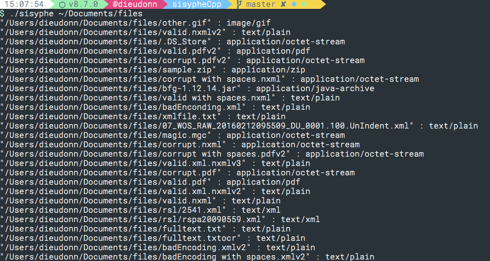

sisypheCPP
==========
A c++ implementation of the [sisyphe](http://github.com/jupitex/sisyphe) project

### Requirements

You need Libmagic & boost installed to dev on sisypheCPP.
- On linux :`sudo apt install libmagic-dev && sudo apt-get install libboost-all-dev`
- On OSX : `brew install libmagic && brew install boost`
- On windows: I do not know yet.. if you can help you're welcome

Info : I cannot use `<filesystem>` which is a c++17 implementation that clang & msvc do not have implemented yet. 
So when c++17 will be [fully supported by them](http://en.cppreference.com/w/cpp/compiler_support), I will change to it. 

### Build

##### Cmake

You can use your best IDE(clion, xcode...) to build the full project with cmake or in comand line :

`mkdir build && cd build && cmake ..`

##### GCC

`g++ -std=c++14 *.cpp -lz -lboost_system -lboost_filesystem -lmagic -o sisypheCpp`

### Use

The first argument to send to the binary SisypheCpp is the path to explore:

eg:`./sisypheCpp /path/to/analyse` will generate something like:

### What does it do?

For the moment sisypheCPP can find files recursively & detect it's mimetype on a single thread.

